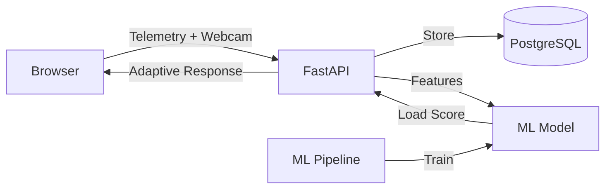

# Adaptive Learning via Cognitive Load Estimation

[](https://github.com/yourusername/adaptive-load-tutor/actions)

An AI-driven, web-based CS tutoring system that **estimates learners' cognitive load in real time** using interaction telemetry and privacy-preserving webcam features, then **adapts instruction dynamically** to optimize learning outcomes.

## Architecture



> See [docs/architecture.md](docs/architecture.md) for full system documentation and [docs/diagrams/](docs/diagrams/) for Mermaid source files.

## Features

- **Real-time cognitive load estimation** from 14 behavioral + visual signals
- **Adaptive problem sequencing** — difficulty adjusts based on estimated load
- **Privacy-first webcam processing** — Face Mesh runs in-browser, only 6 numeric features transmitted
- **17 CS problems** across 5 categories (basics, strings, arrays, recursion, data structures)
- **ML training pipeline** — GradientBoosting/RandomForest/Ridge with 5-fold CV
- **A/B testing framework** — deterministic hash-based variant assignment for research
- **Research dashboard** — load timelines, feature correlations, experiment comparisons
- **JWT authentication** with multi-user session tracking
- **Docker deployment** — one command startup with PostgreSQL

## Quick Start

### Prerequisites

- **Python 3.11+** (tested on 3.13)
- **Node.js 18+** (tested on 20)
- **npm 9+**
- **Git**

### Option 1: Docker (Recommended)
```bash
git clone https://github.com/yourusername/adaptive-load-tutor.git
cd adaptive-load-tutor
docker compose up
# Open http://localhost:3000
```

### Option 2: Local Development

#### Backend
```bash
cd backend

# Create and activate virtual environment
python -m venv .venv
# Linux/macOS:
source .venv/bin/activate
# Windows PowerShell:
.venv\Scripts\Activate.ps1

# Install dependencies
pip install --upgrade pip
pip install -r requirements.txt

# Start the API server
uvicorn app.main:app --reload --port 8000
# API docs at http://localhost:8000/docs
```

#### Frontend (new terminal)
```bash
cd frontend

# Install dependencies (use --legacy-peer-deps if you hit peer conflicts)
npm install --legacy-peer-deps

# Start the dev server
npm run dev
# Open http://localhost:3000
```

#### First Use
1. Open http://localhost:3000 in your browser
2. Click the **Register** tab on the login modal
3. Enter any email, display name, and password to create an account
4. Start solving problems — the system adapts in real time

### ML Pipeline
```bash
cd ml
pip install -r requirements.txt
python generate_synthetic_data.py   # Generate 600 synthetic training samples
python train.py                      # Train + evaluate models (5-fold CV)
# Best model saved to ml/artifacts/load_model.joblib
```

Once the model is trained, the backend automatically loads it from `ml/artifacts/load_model.joblib` and uses ML-based predictions instead of the heuristic fallback.

## Tech Stack

| Layer | Technology |
|-------|-----------|
| Frontend | Next.js 16, TypeScript, Tailwind CSS 3, Recharts |
| Backend | FastAPI 0.115, SQLAlchemy 2.0, Pydantic 2.x |
| Auth | JWT (python-jose) + bcrypt |
| Database | SQLite (dev) / PostgreSQL 16 (prod) |
| ML | scikit-learn, pandas, numpy, joblib |
| Webcam | FaceMesh (in-browser), EAR blink detection |
| CI/CD | GitHub Actions, Docker Compose, pytest |
| Migrations | Alembic |

## Cognitive Load Signals

| Signal | Source | What It Measures |
|--------|--------|-----------------|
| Compile errors | Code evaluation | Syntax understanding |
| Wrong answers | Test runner | Conceptual gaps |
| Typing pauses | Keystroke timing | Hesitation / thinking |
| Delete ratio | Keystroke metrics | Uncertainty / backtracking |
| Hint requests | UI interaction | Help-seeking behavior |
| Face presence | Webcam | Attention / engagement |
| Gaze dispersion | Webcam | Visual search / confusion |
| Blink rate | Webcam (EAR) | Fatigue / cognitive effort |
| Head motion | Webcam | Restlessness / frustration |

## Project Structure

```
adaptive-load-tutor/
├── .github/workflows/ci.yml          # CI pipeline
├── .env.example                       # Environment variable template
├── docker-compose.yml                 # One-command deployment
├── backend/
│   ├── Dockerfile
│   ├── requirements.txt               # Production dependencies
│   ├── requirements-dev.txt           # Test dependencies (pytest, httpx)
│   ├── pytest.ini
│   ├── alembic.ini
│   ├── alembic/                       # Database migrations
│   ├── app/
│   │   ├── main.py                    # FastAPI app + routes
│   │   ├── auth.py                    # JWT + bcrypt authentication
│   │   ├── models.py                  # 8 ORM models
│   │   ├── schemas.py                 # Pydantic request/response schemas
│   │   ├── crud.py                    # Database operations
│   │   ├── db.py                      # Engine + session factory
│   │   ├── settings.py                # Pydantic settings (env vars)
│   │   ├── features.py                # Load aggregation + heuristic scoring
│   │   ├── ml_inference.py            # ML model loading + prediction
│   │   ├── problems.py                # 17-problem bank
│   │   ├── sequencer.py               # Adaptive problem selection + JS eval
│   │   ├── ab_testing.py              # A/B experiment engine
│   │   └── routers/                   # auth, problems, analytics, experiments
│   └── tests/                         # pytest suite (10 test files)
├── frontend/
│   ├── Dockerfile
│   ├── next.config.js                 # Next.js + Turbopack config
│   ├── tailwind.config.ts             # Tailwind theme (load-level colors)
│   ├── postcss.config.js
│   ├── jest.config.ts
│   ├── src/
│   │   ├── app/
│   │   │   ├── layout.tsx             # Root layout with AuthProvider
│   │   │   ├── page.tsx               # Entry point (auth gate + tutor)
│   │   │   ├── globals.css            # Tailwind directives
│   │   │   └── dashboard/page.tsx     # Analytics dashboard
│   │   ├── components/
│   │   │   ├── Tutor.tsx              # Main two-column tutor UI
│   │   │   ├── CodeEditor.tsx         # Editor with keystroke metrics
│   │   │   ├── LoadGauge.tsx          # SVG cognitive load gauge
│   │   │   ├── WebcamFeatures.tsx     # Real webcam integration
│   │   │   ├── ProblemDescription.tsx # Problem display
│   │   │   ├── ProblemSidebar.tsx     # Problem list with status
│   │   │   ├── HintPanel.tsx          # Progressive hints
│   │   │   ├── AuthModal.tsx          # Login/Register modal
│   │   │   ├── Navbar.tsx             # Top navigation bar
│   │   │   └── dashboard/            # Analytics components (5 files)
│   │   ├── context/AuthContext.tsx     # Auth state management
│   │   └── lib/
│   │       ├── api.ts                 # API client with auth headers
│   │       ├── faceMeshProcessor.ts   # Webcam feature extraction
│   │       └── types.ts              # Shared TypeScript types
│   └── src/__tests__/                 # Jest test suite
├── ml/
│   ├── requirements.txt
│   ├── train_config.yaml              # Model hyperparameters
│   ├── generate_synthetic_data.py     # Bootstrap 600 training samples
│   ├── export_training_data.py        # Extract from database
│   ├── train.py                       # Model training + evaluation
│   └── artifacts/                     # Saved models + reports + plots
└── docs/
    ├── architecture.md                # System documentation + API reference
    ├── RESEARCH_PROTOCOL.md           # Study design + IRB considerations
    └── diagrams/                      # Mermaid architecture diagrams
```

## Research Design

This system supports formal A/B studies comparing adaptive vs. static tutoring. See [docs/RESEARCH_PROTOCOL.md](docs/RESEARCH_PROTOCOL.md) for:
- Between-subjects study design (Control / Heuristic / ML Model)
- Participant criteria and recruitment protocol
- Measures: learning gain, time-to-correct, completion rate, hint usage
- Statistical analysis plan (ANOVA, effect sizes, feature correlations)
- IRB considerations and privacy safeguards

## API Documentation

The API is fully documented via FastAPI's auto-generated OpenAPI docs:
- **Swagger UI**: http://localhost:8000/docs
- **ReDoc**: http://localhost:8000/redoc

### Key Endpoints

| Method | Endpoint | Purpose |
|--------|----------|---------|
| POST | `/auth/register` | Create account |
| POST | `/auth/login` | Get JWT token |
| GET | `/auth/me` | Get current user |
| POST | `/sessions` | Create/update session |
| POST | `/events/batch` | Ingest telemetry events |
| POST | `/webcam/batch` | Ingest webcam features |
| GET | `/load/{session_id}` | Get cognitive load estimate |
| GET | `/problems` | List all problems |
| GET | `/problems/next/{session_id}` | Get adaptive next problem |
| POST | `/problems/submit` | Submit solution |
| GET | `/analytics/sessions` | Session summaries |
| GET | `/analytics/aggregate` | Global statistics |
| GET | `/analytics/export/csv` | Export data as CSV |

See [docs/architecture.md](docs/architecture.md) for the complete endpoint reference.

## Ethics & Privacy

- **No raw video stored** — all webcam processing happens in-browser
- **Explicit consent** required for webcam features (opt-in toggle)
- **Feature-only transmission** — only 6 numeric values per 2-second window
- **Anonymized sessions** — random UUIDs, no PII in telemetry
- **Data minimization** — designed for IRB-compatible research deployment

## Running Tests

```bash
# Backend (from backend/ with venv activated)
pip install -r requirements-dev.txt
pytest --cov=app -v

# Frontend (from frontend/)
npm test
```

## Troubleshooting

| Issue | Solution |
|-------|---------|
| `Cannot find module 'tailwindcss'` | Run `npm install --legacy-peer-deps` in frontend/ |
| `passlib` / bcrypt errors on Python 3.13 | Already fixed — uses `bcrypt` directly, not `passlib` |
| Hydration mismatch on `<body>` | Caused by browser extensions (Grammarly, MetaMask) — harmless, suppressed |
| `ERESOLVE` peer dependency conflict | Use `npm install --legacy-peer-deps` |
| `Failed to fetch` on register/login | Ensure backend is running on port 8000 |
| Turbopack config warning | Already fixed — `turbopack: {}` in next.config.js |

## Author

**Alex Chidera Umeasalugo**
Undergraduate Computer Science Researcher
Interests: AI for Education, Intelligent Tutoring Systems, Human-Centered AI, Distributed Systems

## License

This project is for academic and research purposes.
