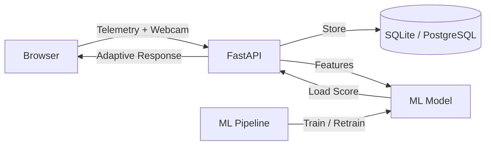

# Adaptive Learning via Cognitive Load Estimation

[](https://github.com/Space-Paragon1/Adaptive-learning-via-CLE/actions)

An AI-driven, web-based CS tutoring system that **estimates learners' cognitive load in real time** using interaction telemetry and privacy-preserving webcam features, then **adapts instruction dynamically** to optimize learning outcomes.

## Architecture



## Features

- **Real-time cognitive load estimation** from 14 behavioral + visual signals
- **Adaptive problem sequencing** — difficulty adjusts based on estimated load (LOW → harder, HIGH → easier)
- **Privacy-first webcam processing** — Face Mesh runs in-browser, only 6 numeric features transmitted
- **39 CS problems** across 8 categories (basics, strings, arrays, sorting, recursion, dynamic programming, data structures, OOP)
- **ML training pipeline** — GradientBoosting / RandomForest / Ridge with 5-fold CV
- **Admin retraining endpoint** — `POST /admin/retrain` exports real labeled data and hot-swaps the model
- **A/B testing framework** — deterministic hash-based variant assignment with chi-squared significance testing
- **Research dashboard** — load timelines, feature correlations, experiment comparisons
- **JWT authentication** with persistent solved-problem tracking across sessions
- **Rate limiting** on all ingestion endpoints (slowapi)
- **Error boundaries** on frontend to prevent full-page crashes
- **Docker deployment** — one-command startup with PostgreSQL

## Quick Start

### Prerequisites

- **Python 3.11+** (tested on 3.13)
- **Node.js 18+** (tested on 24)
- **npm 9+**
- **Git**

### Option 1: Docker (Recommended)
```bash
git clone https://github.com/Space-Paragon1/Adaptive-learning-via-CLE.git
cd Adaptive-learning-via-CLE
docker compose up
# Open http://localhost:3000
```

### Option 2: Local Development

#### Backend
```bash
cd backend

# Create and activate virtual environment
python -m venv .venv
# Linux/macOS:
source .venv/bin/activate
# Windows PowerShell:
.venv\Scripts\Activate.ps1

# Install dependencies
pip install --upgrade pip
pip install -r requirements.txt

# Start the API server (use venv Python explicitly on Windows)
.venv\Scripts\uvicorn app.main:app --reload --port 8000
# API docs at http://localhost:8000/docs
```

> **Windows / OneDrive note:** If you see `OSError: [Errno 22] Invalid argument` on startup,
> run `.venv\Scripts\pip install --force-reinstall anyio websockets` to fix broken OneDrive
> placeholder files, then retry. Also right-click the project folder in Explorer →
> "Always keep on this device" to prevent recurrence.

#### Frontend (new terminal)
```bash
cd frontend
npm install --legacy-peer-deps
npm run dev
# Open http://localhost:3000
```

#### First Use
1. Open http://localhost:3000
2. Click **Register** and create an account
3. Start solving problems — the system adapts difficulty in real time based on your cognitive load
4. Rate your effort (1–7 slider) to contribute labeled training data
5. Visit http://localhost:3000/dashboard for analytics

### ML Pipeline

#### Option A — Synthetic bootstrap (no real data needed)
```bash
cd ml
pip install -r requirements.txt
python generate_synthetic_data.py   # Generate 600 synthetic training samples
python train.py                      # Train + evaluate (5-fold CV)
# Best model saved to ml/artifacts/load_model.joblib
```

#### Option B — Retrain on real collected data (via API)
```bash
# Once users have submitted effort ratings, call the admin endpoint:
curl -X POST http://localhost:8000/admin/retrain
# Exports real labeled data from DB → retrains → hot-swaps model in-process
# Requires >= 10 labeled samples (effort ratings submitted by users)
```

Once trained, the backend automatically loads the model and uses ML predictions instead of the heuristic fallback.

## Tech Stack

| Layer | Technology |
|-------|-----------|
| Frontend | Next.js 16, TypeScript, Tailwind CSS 3, Recharts |
| Backend | FastAPI 0.115, SQLAlchemy 2.0, Pydantic 2.x |
| Auth | JWT (python-jose) + bcrypt |
| Rate Limiting | slowapi |
| Database | SQLite (dev) / PostgreSQL 16 (prod) |
| ML | scikit-learn, scipy, pandas, numpy, joblib |
| Webcam | FaceMesh (in-browser), EAR blink detection |
| CI/CD | GitHub Actions, Docker Compose, pytest |
| Migrations | Alembic |

## Cognitive Load Signals

| Signal | Source | What It Measures |
|--------|--------|-----------------|
| Compile errors | Code evaluation | Syntax understanding |
| Wrong answers | Test runner | Conceptual gaps |
| Typing pauses | Keystroke timing | Hesitation / thinking |
| Delete ratio | Keystroke metrics | Uncertainty / backtracking |
| Hint requests | UI interaction | Help-seeking behavior |
| Face presence | Webcam | Attention / engagement |
| Gaze dispersion | Webcam | Visual search / confusion |
| Blink rate | Webcam (EAR) | Fatigue / cognitive effort |
| Head motion | Webcam | Restlessness / frustration |

## Problem Bank

39 problems across 8 categories and 5 difficulty levels:

| Category | Count | Difficulty |
|----------|-------|-----------|
| Basics | 6 | 1 |
| Strings | 6 | 2 |
| Arrays | 7 | 3 |
| Sorting | 2 | 3 |
| Recursion | 6 | 4 |
| Dynamic Programming | 2 | 4 |
| Data Structures | 7 | 5 |
| Strings (advanced) | 3 | 5 |

## Project Structure

```
adaptive-load-tutor/
├── .github/workflows/ci.yml          # CI pipeline
├── .env.example                       # Environment variable template
├── docker-compose.yml                 # One-command deployment
├── backend/
│   ├── requirements.txt               # Production dependencies
│   ├── requirements-dev.txt           # Test dependencies (pytest, httpx)
│   ├── pytest.ini
│   ├── alembic.ini
│   ├── alembic/                       # Database migrations
│   └── app/
│       ├── main.py                    # FastAPI app + lifespan + rate limiting
│       ├── auth.py                    # JWT + bcrypt authentication
│       ├── models.py                  # 8 ORM models (UTC-aware datetimes)
│       ├── schemas.py                 # Pydantic request/response schemas
│       ├── crud.py                    # Database operations
│       ├── db.py                      # Engine + session factory (SA 2.0 style)
│       ├── settings.py                # Pydantic settings (env vars)
│       ├── features.py                # Load aggregation + heuristic scoring
│       ├── ml_inference.py            # ML model loading + prediction + hot-swap
│       ├── problems.py                # 39-problem bank
│       ├── sequencer.py               # Adaptive problem selection + JS eval
│       ├── ab_testing.py              # A/B experiment engine
│       └── routers/
│           ├── auth_router.py         # register, login, /me, /me/solved
│           ├── problems_router.py     # list, detail, next, submit
│           ├── analytics_router.py    # sessions, aggregate, timeline, correlations
│           ├── experiments_router.py  # create, results (+ chi-squared p-value)
│           └── admin_router.py        # retrain, retrain/status
├── frontend/
│   ├── src/
│   │   ├── app/
│   │   │   ├── layout.tsx             # Root layout with AuthProvider
│   │   │   ├── page.tsx               # Entry point (auth gate + ErrorBoundary)
│   │   │   └── dashboard/page.tsx     # Analytics dashboard
│   │   ├── components/
│   │   │   ├── Tutor.tsx              # Main tutor UI (loads persistent solved IDs)
│   │   │   ├── CodeEditor.tsx         # Editor with keystroke metrics
│   │   │   ├── LoadGauge.tsx          # SVG cognitive load gauge
│   │   │   ├── WebcamFeatures.tsx     # Webcam integration (consent-gated)
│   │   │   ├── ErrorBoundary.tsx      # Catches runtime errors gracefully
│   │   │   ├── ProblemDescription.tsx
│   │   │   ├── ProblemSidebar.tsx
│   │   │   ├── HintPanel.tsx
│   │   │   ├── AuthModal.tsx
│   │   │   ├── Navbar.tsx
│   │   │   └── dashboard/             # 5 analytics chart components
│   │   ├── context/AuthContext.tsx
│   │   └── lib/
│   │       ├── api.ts
│   │       ├── faceMeshProcessor.ts
│   │       └── types.ts
│   └── src/__tests__/                 # Jest test suite (2 files)
├── ml/
│   ├── train_config.yaml              # Model hyperparameters
│   ├── generate_synthetic_data.py     # Bootstrap 600 training samples
│   ├── export_training_data.py        # Extract from database → CSV
│   ├── train.py                       # Training + 5-fold CV + artifact export
│   └── artifacts/                     # Saved models + reports + plots
└── docs/
    ├── architecture.md
    ├── RESEARCH_PROTOCOL.md
    └── diagrams/
```

## API Reference

Full interactive docs at **http://localhost:8000/docs**

### Auth
| Method | Endpoint | Purpose |
|--------|----------|---------|
| POST | `/auth/register` | Create account → JWT |
| POST | `/auth/login` | Login → JWT |
| GET | `/auth/me` | Current user info |
| GET | `/auth/me/solved` | Problem IDs solved across all sessions |

### Tutoring
| Method | Endpoint | Purpose |
|--------|----------|---------|
| POST | `/sessions` | Create/update session |
| POST | `/events/batch` | Ingest telemetry (120 req/min limit) |
| POST | `/webcam/batch` | Ingest webcam features (60 req/min limit) |
| POST | `/labels/effort` | Submit effort rating 1–7 (30 req/min limit) |
| GET | `/load/{session_id}` | Get cognitive load estimate |
| GET | `/problems` | List all 39 problems |
| GET | `/problems/{id}` | Problem detail with hints |
| GET | `/problems/next/{session_id}` | Adaptive next problem |
| POST | `/problems/submit` | Submit + evaluate solution |

### Analytics & Research
| Method | Endpoint | Purpose |
|--------|----------|---------|
| GET | `/analytics/aggregate` | Global stats (sessions, events, mean load) |
| GET | `/analytics/sessions` | Session summaries with mean load |
| GET | `/analytics/sessions/{id}/timeline` | Load over time for a session |
| GET | `/analytics/feature_correlations` | Pearson r per feature vs effort |
| GET | `/analytics/ab_results` | Variant comparison across all experiments |
| GET | `/analytics/export/csv` | Stream all events as CSV |
| POST | `/experiments` | Create A/B experiment |
| GET | `/experiments/{id}/results` | Variant stats + chi-squared p-value |

### Admin
| Method | Endpoint | Purpose |
|--------|----------|---------|
| POST | `/admin/retrain` | Export real data → retrain → hot-swap model |
| GET | `/admin/retrain/status` | Check model artifact age |

## Running Tests

```bash
# Backend — 34 tests, all passing
cd backend
pip install -r requirements-dev.txt
pytest -v

# Frontend
cd frontend
npm test
```

## Research Design

This system supports formal A/B studies comparing adaptive vs. static tutoring. See [docs/RESEARCH_PROTOCOL.md](docs/RESEARCH_PROTOCOL.md) for:
- Between-subjects study design (Control / Heuristic / ML / Full-Adaptive variants)
- Measures: learning gain, time-to-correct, completion rate, hint usage
- Statistical analysis: chi-squared significance on A/B results, Pearson correlations
- IRB considerations and privacy safeguards

## Ethics & Privacy

- **No raw video stored** — all webcam processing happens in-browser
- **Explicit consent** required for webcam features (opt-in toggle)
- **Feature-only transmission** — only 6 numeric values per 2-second window
- **Anonymized sessions** — random UUIDs, no PII in telemetry
- **Data minimization** — designed for IRB-compatible research deployment

## Troubleshooting

| Issue | Solution |
|-------|---------|
| `OSError: [Errno 22] Invalid argument` on startup | OneDrive placeholder files: run `.venv\Scripts\pip install --force-reinstall anyio websockets` |
| `no such column: sessions.user_id` | Stale SQLite DB: run `ALTER TABLE sessions ADD COLUMN user_id VARCHAR` or delete `adaptive_load.db` |
| Port 3000 already in use | Run `Stop-Process -Id <pid> -Force` or use `npm run dev -- --port 3001` |
| `Cannot find module 'tailwindcss'` | Run `npm install --legacy-peer-deps` in frontend/ |
| `Failed to fetch` on login | Ensure backend is running on port 8000 |
| `passlib` / bcrypt errors on Python 3.13 | Already fixed — uses `bcrypt` directly |
| Turbopack config warning | Already fixed — `turbopack: {}` in next.config.js |
| `ERESOLVE` peer conflict | Use `npm install --legacy-peer-deps` |

## Author

**Alex Chidera Umeasalugo**
Undergraduate Computer Science Researcher
Grambling State University
Interests: AI for Education, Intelligent Tutoring Systems, Human-Centered AI, Distributed Systems

## License

This project is for academic and research purposes.
